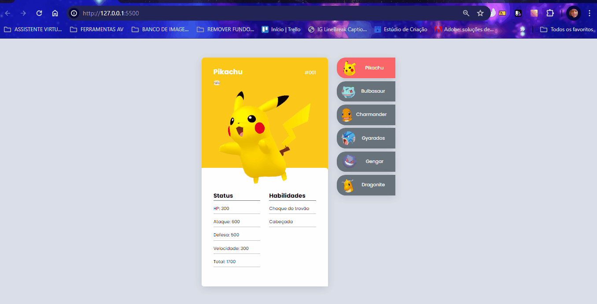
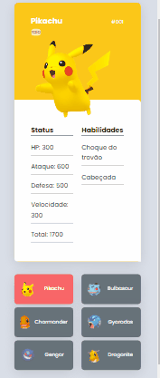

# Projeto Pokedex

Um projeto com personagens de Pokémons com menu clicável contendo botões selecionáveis ao lado direito do Pokémon maior, onde conforme seleciona outros Pokémons fica automáticamente a esquerda em tamanho maior para que apareçam para telas de desktops e celulares 📲💻

## Tecnologias utilizadas
- HTML
- CSS
- JAVASCRIPT

## 📂 Acesso ao projeto

Você pode acessar o código fonte do projeto 

<https://github.com/denisero19/pokedex>